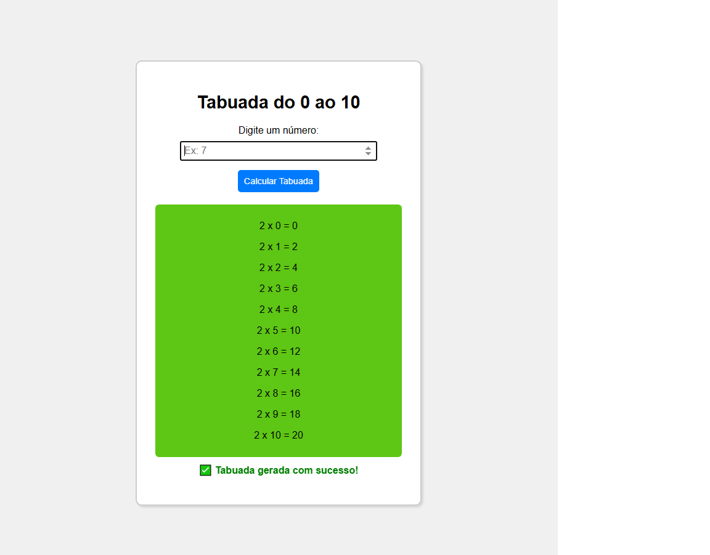

# 📌 Tabuada Interativa

Este projeto foi desenvolvido como exercício da disciplina **Programação Web (Senac)**.

A proposta era criar uma página HTML com JavaScript que:

- Recebe um número digitado pelo usuário
- Exibe a tabuada do número (de 0 a 10)
- Apresenta os resultados de forma dinâmica na tela
- Aplica validações básicas (ex: campo vazio ou valor inválido)
- Estiliza o conteúdo com CSS
- Utiliza funções, eventos, manipulação de DOM e estruturas de repetição

## Tecnologias usadas

- HTML5
- CSS3
- JavaScript puro (vanilla JS)

O projeto segue os exemplos e orientações apresentados em aula, com algumas melhorias visuais (cores dinâmicas e mensagens amigáveis) para tornar a experiência mais interativa.
